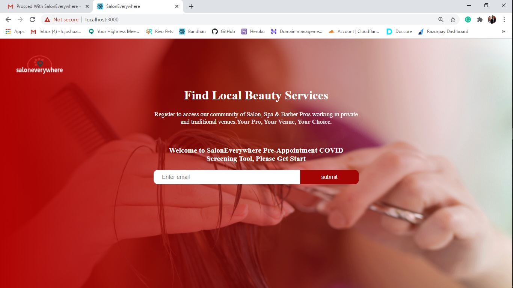
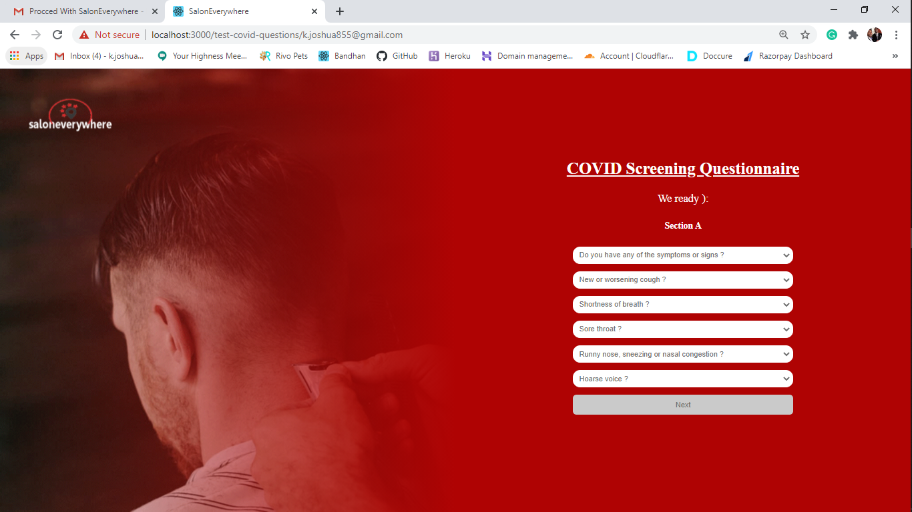
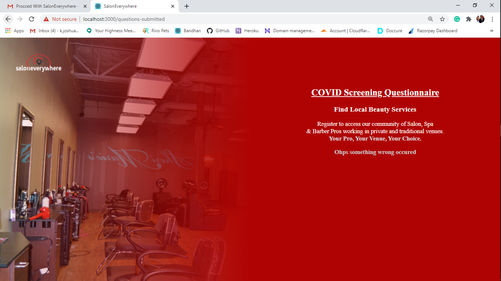

## SalonEverywhere-frontend What is SalonEverywhere? 
We’re a marketplace and booking platform that safely and easily connects clients with beauty pros offering services in private or traditional venues. Private venues include your home, a stylist space or a salon suite. Traditional venues include multi-chair salons, spas &amp; barbershops.  Your Pro, Your Venue, Your Choice!
<br>

## Features

- All users who wishes they Landing on Home page of SalonEverywhere Application.
- All Users who want to complete covid-19 testwith SalonEverywhere Application.

## Test SalonEverywhere UI Templates

Before we get started Remember to take  :coffee:   :pizza:  and :dancer:   When You Are coding, come on Dude it all about relax

- [SalonEverywhere UI Templates Application for Test](https://SalonEverywhere-frontend.herokuapp.com/).

## Backend tools

 - All Neccessary libraries.
 - ReactJS.

Other tools and technologies used in development of this application are;
- Hoster: [Heroku](https://heroku.com/).
- Text Editor: [VSCode](https://code.visualstudio.com), [Sublime Text](https://www.sublimetext.com/).

#### Getting Start With Project

1. Clone the github repository [here](https://github.com/key-joshua/SalonEverywhere-frontend.git). 

- Clone this project on your machine , by running this command on in your command line or Terminal:
 ```
git clone https://github.com/key-joshua/SalonEverywhere-frontend.git
 ```
 - move to the cloned repository by running this command:
 ```
cd  SalonEverywhere-frontend
 ```
 
 - Install the required dependencies found in package.json by running this command:
 ```
npm install
 ```
 - And then to start running  this project on your machine , run this command:
 ```
npm start
```

#### Deployment

- heroku : [SalonEverywhere](https://SalonEverywhere-frontend.herokuapp.com/).
#### Dedicated: [SalonEverywhere-Teachnical-Test](https://docs.google.com/document/d/1LcnZ0zrGXertDPFWq8Y3VnUk2woDgDqQnucpv6_fydA/edit).

#### Develoer: [Key Joshua](https://www.instagram.com/key_joshua/).


#### Completed Tasks ScreenShots





